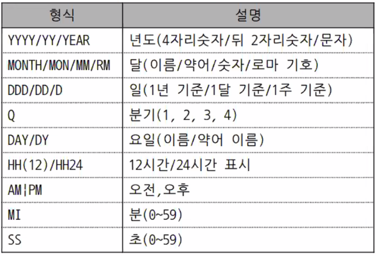

### Oracle 설치

설치 이후 cmd 에서 (최초접속)

` sqlplus / as sysdba`

` alter user hr identified by hr account unlock;`

`conn hr/hr`

(이후 부터는)`sqlplus hr/hr` 로 접속 가능


## SQL (Structure Query Language)

### CRUD

C - insert

R - select

U - update

D - delete


### SELECT 구문

```sql
SELECT 특정 column 이름 | *(전체 column) | 표현식 | DISTINCT | AS column 별칭
FROM 테이블 이름 ;
WHERE 조건식
GROUP BY 기준 COLUMN
HAVING 조건식 (GROUP BY의 조건식)
ORDER BY 기준 COLUMN
```

- 별칭은 반드시 문자로 시작해야 함
- 특수문자(공백) 들어갈 경우에는 단어 전체를 `" "` 로 감싸주어야 함 .예시:  `"급여(원)" ` 

전체 column 가져오는 경우에는 예시

```sql
SELECT *
FROM EMPLOYEE;
```

#### DISTINCT 키워드

중복된 값을 제거하고 한번만 출력할 때 사용하는 키워드

```sql
SELECT DISTINCT JOB_ID
FROM EMPLOYEE;
```

#### 더미 column

` SELECT AS '셀의 내용' AS 열이름` : ' '로 감싸면 셀에 해당 내용이 들어간 더미 column 생성됨


#### WHERE

조건을 넣어 표시할 행을 제한 할 수 있음

```sql
SELECT *
FROM EMPLOYEE
WHERE DEPT_ID = 90
```


### ORDER BY

```sql
ORDER BY [기준 COLUMN] [ASC | DESC]
```

<u>기준 COLUMN 이름 대신 열의 번호를 넣어도 됨.</u>

### GROUP BY

```sql
GROUP BY [기준 COLUMN]
```

- COLUMN 의 값을 기준으로 묶어줌
- GROUP BY에 기준이 된 열은 SELECT에 단일함수로 사용 가능

### HAVING

```sql
GROUP BY DEPT_ID
HAVING AVG(SALARY) > 3000000
```

GROUP BY 의 조건 설정


#### 연결 연산자 ||

하나의 셀 안에 내용이 연결되어 들어감

```sql
SELECT ID || '의 월급은' || NAME || SALARY || '입니다'
```

#### 비교 연산자

- `BETWEEN AND` : 값이 지정한 범위(경계 포함)에 포함되면 TRUE 반환 : `BETWEEN 하한값 AND 상한값` 
- `LIKE / NOT LIKE` : 비교하려는 값이 특정한 pattern 을 만족하면 TRUE 반환 : wild card 사용
  - % : 0개 이상의 문자열 ( 예 : 김씨 성 가진 이름 -> `NAME LIKE '김%'` )
  - _ : 문자 1개 ( 예: 9로 시작하는 3자리 수 -> `NUM LIKE '9__'`)
  - `ESCAPE ''` ' ' 안에 넣는 특수문자(%, _)를 특수문자로 입력 받음 -> [ ] 에 넣는것과 동일
- `IS NULL / IS NOT NULL`
- `IN` : OR와 비슷 : ( 예 : `DEPT IN ('20', '90')`) : 안에 들어가는 변수의 타입을 맞춰야 함


#### Data type

- `CHAR` : 고정 길이 (모자라는 부분은 공백으로 채워넣음) : **사용 안하는게 좋다**. 한글 사용시 이상해짐
- `VARCHAR2` : 가변 길이


### 단일 함수
(SELECT, WHERE 에 적용 가능)

#### single-row funcition : 함수 적용 전 후 결과 행 수가 동일

#### group function : 함수 적용 전 후 결과 행 수가 줄어듬


- `LENGTH()` : 문자의 개수를 반환

- `LPAD / RPAD ` : 문자열에 길이를 덧붙임 (정렬 목적으로 사용)

  `  LPAD(email, 30, '.')` : ................abced@abc 와 같이 반환됨 : 전체 길이가 30byte 라는 의미

-  `TRIM / LTRIM / RTRIM` : 문자를 제거함

  ` LTRIM` == `TRIM(LEADING)` / `RTRIM` == `TRIM(TRAILING)`

  `LTRIM('       TEST')` : 왼쪽 공백 제거됨 -> TEST 반환

  ` LTRIM('XZYXXXTEST', 'XYZ')` : X or Y or Z 를 왼쪽에서 부터 제거함 -> TEST 만 반환

- `SUBSTR( string, position, [length])` : 1부터 숫자 세기 시작, position은 부호에 따라 시작 방향 결정

  SELECT SUBSTR('THIS is a test', 6, 2) : is

  SELECT SUBSTR('this is a test', 6) : is a test

  SELECT SUBSTR('TechOnTheNet', -3, 3) : Net

- `ROUND( number, [decimla_places])` : 지정 자리수에서 반올림

  SELECT ROUND(125.315, 1) : 125.3

  SELECT ROUND(125.315, -1) : 130

- `TRUNC( number, [decimal_places])` : 지정 자리수부터 버림

- `SYSDATE` : 현재 날짜 반환

- `ADD_MONTHS( date, N)` : 지정한 달만큼 달 수를 더한 날짜를 반환

- `MONTHS_BETWEEN( date1, date2)` : 지정한 두 날짜 사이의 월 수를 반환 (date1 > date2 -> 양수 반환)

- `INSTR( string, search_char, [position, occurrence])` : 해당 문자의 index 반환


### 데이터 타입 변환

- 명시적 변환 (오라클에서만 사용됨, CONVERT 사용 불가)

  - `TO_CHAR`

    - 9 : 자리수 지정

    - 0 : 남는 자리를 0으로 표시 ( SELECT TO_CHAR(1234, '09,999' ) -> 01,234

    - $ 또는 L : 통화기호 표시

    - . 또는 , : 지정한 위치에 . 또는 , 표시

      

  - `TO_DATE`

    - CHAR 를 입력받아야만 함

    - 입력받은 정수형 문자열과 동일한 규격으로 반환 형태를 정해줘야 함 ( `SELECT TO_DATE('041030 143000', 'YYMMDD HH24MISS')`)

    - 원하는 format으로 날짜를 구성하기 위해서는 TO_CHAR(TO_DATE) 와같은 방법으로 두번 변환해주면 가능

      ```sql
      WHERE TO_CHAR(HIRE_DATE, 'YYMMDD') = '900401'  
      -- 위와 같이 값을 변환해서 검색하는 방식은 성능 저하 문제가 있어 사용하지 말것!
      ```

      

  - `TO_NUMBER` 

    - CHAR 를 입력받아야만 함

    

- 묵시적 변환

  - DBMS 이 알아서 자체적으로 변환


#### 기타 함수 NVL

- NULL을 지정한 값으로 변환

- `NVL ( A, B)` 특정 A열의 NULL 값을 뒤에 넣어준 B의 값으로 변환

- <u>NULL 이 계산에 들어가면 결과도 NULL이 나오는 경우에 유용하게 사용 가능</u>

  

#### 기타함수 DECODE (오라클 전용)

- SELECT 에서 IF-ELSE 논리를 구현하는 함수
- `DECODE( expr, search1, result1 [ ,searchN, resultN,] [,default] )` : expr = search 이면 result 반환


#### 단일 행 함수 CASE (DECODE와 유사한 표준 함수 :  MariaDB, mysql 에서 사용 가능)

- ` CASE expr WHEN serach1 THEN result1 [WHEN.. THEN..] [ELSE default] END`
- `CASE WHEN condition1 THEN result1 [WHEN.. THEN.. ] [ELSE default] END`
- condition에 조건을 넣을 수 있는 특징


### 그룹 함수

- 그룹 함수가 SELECT 에 사용되면 다른 column 정의가 불가능함. (결과 행의 개수가 달라져서?)
- 그룹 함수는 NULL값 제거 후 연산을 수행
- `SUM`
- ``AVG`
- `MIN`
- ``MAX`
- `COUNT`

