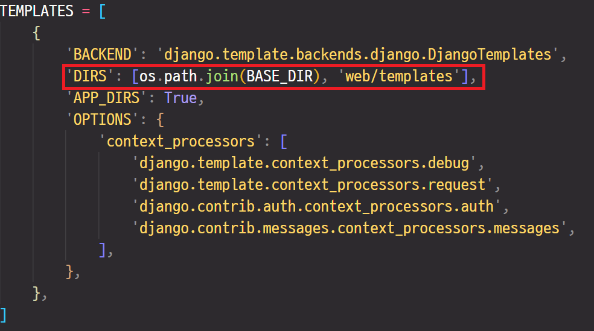
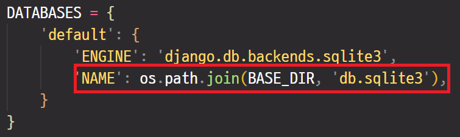

# django


### 초기 설정

- pycharm terminal 에서 다음 명령어로 시작

`django-admin startproject baseWEB` : baseWEB 부분은 프로젝트 이름임.


- 웹 서버 없이 로컬에서 호스팅 하는 설정

  `settings.py` 

```python
ALLOWED_HOSTS = ['localhost', '127.0.0.1']
```


- 타임존 변경

```python
TIME_ZONE = 'Asia/Seoul'
```


- 서버 실행

` python manage.py runserver`

- 앱 추가

`python manage.py startapp 앱이름` 


### 기본 동작 원리

view 는 model을 통해 db를 처리하고, template을 통해 html 렌더링 한다.


#### http method

- POST : 입력 데이터가 URL에 노출되지 않고 요청 메세지 바디에 들어감
- GET : 입력 데이터가 url 뒤 ?이후에 노출되어 전달됨

> py 파일에 작성할때는 모두 대문자로 작성해야 함. `request.POST['abc']` 


### 기초

#### 상대경로

`../login` : root 에서 시작하는 상대경로 지정 방법

#### urls.py

```python
path('basketball', views.basketball, name='basket'),       # urls.py 에 이름 지정
    
<a href="">농구</a>  # html에서 이름으로 호출
```

위와 같이 `name`을 지정하면 경로 호출시 이름을 가지고 호출 가능


#### views.py 에서 data 넘기기

````python
def chart(request):
    context = {'key' : 'value', 'key2' : 'value2'}  #key-value 구조만 넘길 수 있다.
    return render(request, 'chartDemo.html', context)
````

위와 같이 넘겨진 data는 `<body>`영역 안에서 `{{key}}`로 `value`를 호출해서 사용할 수 있음

` a = {{key}}` 와 같은 형태로 변수에 넣어  `<script>` 영역에서도 사용 가능


#### views.py 에서 화면 표시하기

- `JsonResponse()`
- `render()` : 현재 페이지 위에 html을 덮어씌우는 느낌. 주소가 변경되지 않음.
- `redirect()` : urls.py에 적힌 이름에 따라 해당 함수도 같이 실행됨. (view 내부에서 변경된 데이터를 반영해서 새로 request 후에 페이지 불러오는 느낌) : <u>함수가 함수를 호출하는게 불가능하기 때문에!</u>


### jQuery

interpreter 기반이므로 순서에 맞게 <head>, <body> 에 넣어야 함

```javascript
/* jQuery 최신 버전 사용 */
<script src="http://code.jquery.com/jquery-latest.min.js"></script>  

/* body 영역에서 함수 사용 시작 */
<script>
    $(document).ready(function() {
    })	
</script>
```


#### loop

```javascript
$.each()
```


#### 내용 추가

- `append()`

- `html()`

- `text()`

  ```javascript
  txt += '<tr><td>' + data.id + '</td><td>' + data.pwd + '</td></tr>'
  $('#tbody').html(txt)
  ```

  

#### 내용 받아오기 

- `val()`

  ```javascript
  param = $('#id').val()
  alert(param)
  ```

  

#### ajax - 비동기 통신

서버에서 클라이언트를 호출하는 느낌 : page reloading 없이 페이지 수정

py 에서 data를 다양한 방법으로 입력해서 json으로 변경해서 

```html
<button class="ajaxBtn">ajaxBtn</button>
<input type="text" name="user_id" id="user_id">
<input type="password" name="user_pwd" id="user_pwd">

<script>
$('.ajaxBtn').click(function(){              //버튼이 눌리면 실행
     $.ajax({
         url : '',   //정보를 가져오려는 page 호출
         type : 'post',   //post 방식
         data : {'csrfmiddlewaretoken' : '{{csrf_token}}', //csrf 보안 기본 설정
             user_id1 : $('#user_id').val() ,   //views
             user_pwd1 : $('#user_pwd').val() },
         dataType : 'json',   //data를 json으로 받겠다
         success : function(list){ //data를 받고 나면 실행 받아온 data가 list에 들어감.
             txt=""
             $.each(list, function(idx, data){  //받아온 data로 loop 
                 txt += '<tr><td>' + data.id + '</td><td>' + data.pwd + '</td></tr>'
             })
             $('#tbody').append(txt) // html에 출력
         }
     })
 })
 </script>
```

```python
urlpatterns = [
    path('nonParamAjax/', views.nonAjax, name='nonParamAjax'),
]
```

```python
from django.http import JsonResponse

def nonAjax(requset):              
    id = request.POST['user_id1']    #서버에서 사용하기 위해 입력된 id가져오기
    pwd = request.POST['user_pwd1']
    list2 = [{'id' : 'multicampus04', 'pwd' : 'multicampus04'},      #csv, db 등 다양한 data 사용 가능
            {'id' : 'multicampus05', 'pwd' : 'multicampus05'}]

    return JsonResponse(list2, safe=False) #safe=False는 비동시 통신을 지향한다는 의미, list를 json으로 script로 전달
```


#### script 내부 비동기 예제

```html
<label>제조사</label>
<select id="maker">
    <option>선택하세요</option>
    <option>BMW</option>
    <option>Audi</option>
    <option>Benz</option>
</select>
<label>모델</label>
<select id="model">
    <option>선택하세요</option>
</select>
```

```html
<script>
    bmwAry = ['320d', '520d', '640d', '740d']    //서버에서 내려오는 db를 가정
    audiAry = ['a4', 'a6', 'a8', 'r8']
    benzAry = ['c200', 'e220', 's500', 's600']

function display(ary){
    txt = '<option>선택해주세요</option>' ;
    $.each(ary, function(idx, data) {       //함수 호출하면서 들어온 bmwAry 가 ary에 들어감
        txt += '<option>' + data + '</option>'
    })
    $('#model').empty().html(txt)  // html에 결과 반영
}

$(document).ready(function() {
    $('#maker').change(function(){
        maker = $('#maker').val()
        if(maker=='BMW'){
            display(bmwAry)
        }
        if(maker=='AUDI'){
            display(audiAry)
        }
        if(maker=='BENZ'){
            display(benzAry)
        }
    })
})
</script>
```


### APP 추가 (2개 이상 추가할 경우)

`setting.py`

- INSTALLED_APPS 추가

- staticfiles_dirs 추가  (setting.py)

  - ```python
    STATICFILES_DIRS = [
        os.path.join(BASE_DIR, '앱이름', 'static')
    ]
    ```

- base_dir 수정 (setting.py)

  - ```python
    BASE_DIR = os.path.dirname(os.path.dirname(os.path.abspath(__file__)))
    ```

- static_root 추가 (setting.py)

  - ```python
    STATIC_ROOT = os.path.join(BASE_DIR, 'static')
    ```

- templates base dir 추가

  - 

  - 뒤에 들어가는건 기본 프로젝트 경로의 templates 폴더 (새로 만들어줘야 함) : 각 App 에서 공통으로 사용하고자 하는 template을 기본 프로젝트에 만들어 놓고 공통으로 사용하기 위함

    

- database dir 추가

  - 


- header, footer 공통 사용

  - home.html

  ```html
  
  
  
  
  <!-- Main content -->
  
  
  
  
  ```

  - header.html  / footer.html

  ```html
     <!--맨 위에 추가 -->
  ```

  

  

- 각 App에 흩어져 있는 static file을 한곳으로 모으기

  터미널에서 ` python manage.py collectstatic` -> root에 static 폴더 생성됨


### model 연동

`models.py` 에 class 를 생성해주고, `admin.py`에 등록해주는 과정 필요


#### migration

models.py

```python
from django.db import models

# Create your models here.
class BbsUserRegister(models.Model):    # db 에서 table 생성과 비슷
    user_id = models.CharField(max_length=50)   #sql에서 column 과 같은 느낌
    user_pwd = models.CharField(max_length=50)
    user_name = models.CharField(max_length=50)
    
    def __str__(self):
        return self.user_id + "" + self.user_pwd + "" +self.user_name
```

admin.py

```python
from django.contrib import admin
from .models import *

# Register your models here.
admin.site.register(BbsUserRegister)
```

terminal

`python manage.py makemigrations`

`python manage.py migrate` 


#### superuser 등록

terminal

`python manage.py createsuperuser`

이후 username. password 입력해서  admin 계정 생성 -> /admin 에서 로그인 후 db 관리 가능


#### db 에서 데이터 가져오기 (db 연동)


views.py

```python
from .models import *

def loginProc(request):

    print('request - loginProc') # 디버그
    
    if request.method == 'GET':
        return redirect('index')
    elif request.method == 'POST':
        id = request.POST['id']
        pwd = request.POST['pwd']
    user = BbsUserRegister.objects.filter(user_id = id, user_pwd = pwd) #user를 queryset 형식으로 반환
    #    user = BbsUserRegister.objects.get()    # user에 들어있는 값을 반환
    print(user, type(user))
    if user is not None:
        return redirect('home')
    else :
        return redirect('index')
```


#### orm 함수


##### 선택 

select * from table where id = xxx, and pwd = xxx 인 경우

- `modelName.objects.all()` : 모두 가져온다
- ` modelName.objects.get(id = xxx, pwd = xxx)`
- ` modelName.objects.filter(id = xxx, pwd = xxx)`

select * from table where id = xxx, orpwd = xxx 인 경우

- ` modelName.objects.filter(Q(id = xxx) | Q(pwd = xxx))`    :  조금 특이한 문법!

select * from table where subject like '%공지%'

- ` modelName.objects.filter(subject_icontains='공지')`

select * from table where subject like '%공지'

- ` modelName.objects.filter(subject_endswith='공지')`

select * from table where subject like '공지%'

- ` modelName.objects.filter(subject_startswith='공지')`


##### 삽입

insert into table values()

- `model(attr=value, attr=value)`
- `model.save()`
- ` x = model(attr=value, attr=value)` 과 같은 방식으로 <u>instance를 만들어 사용</u>해야 함 ->  `x.xave()`

##### 삭제

delete * from tableName where id = xxx

- `modelName.objects.get(id=xxx).delete()`

##### 업데이트

update tableName set attr = value where id = xxx

- `obj = modelName.objects.get(id=xxx)`
- `obj.attr = value`
- `obj.save()`    :  commit


