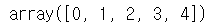
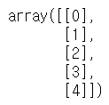
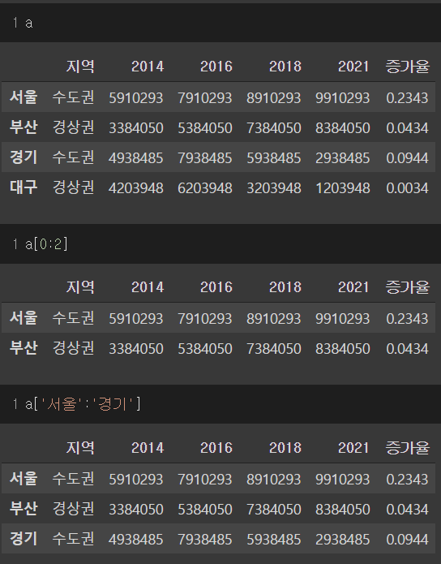
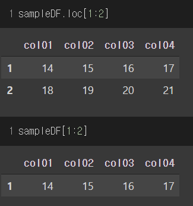
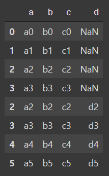
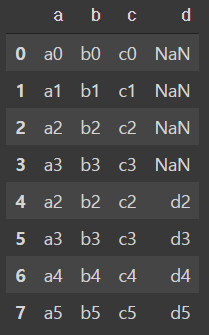
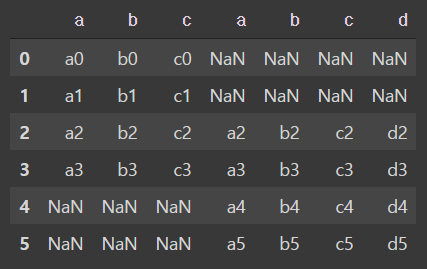

# numpy

`ndarray` 

- 파이썬 list와는 다르게 메모리 사용량이 적다. (numpy 에서 지원하는 자료형)

- 메모리에 연속적으로 배치된다

- `ndim` 배열의 차원 확인

- `shape` 배열의 모양 확인

- 요소의 type이 다르다면, 자동으로 가장 큰 요소의 type으로 모두 변환된다.

  - ```x = np.array([100, "hello", 3.14])``` -> dtype='<U11'

    

#### indexing

- 다차원 배열 인덱싱

  ```python
  m = np.array([[ 0,  1,  2,  3,  4],
              [ 5,  6,  7,  8,  9],
              [10, 11, 12, 13, 14]])
  print(m[1,2])
  #7
  print(m[2,-1])
  #14
  print(m[1,1:3])
  #[6 7]
  print(m[1:,2])
  #[ 7 12]
  print(m[0:2,3:5])
  #[[3 4]
  # [8 9]]
  ```

  

- boolean indexing

  ```python
  odd_even = np.array([0,1,2,3,4,5,6,7,8,9])
  idx = np.array([True, False, True, False, True, False, True, False, True, False])
  odd_even[idx]
  #array([0, 2, 4, 6, 8])
  odd_even[odd_even%2==0]
  #array([0, 2, 4, 6, 8])
  ```

- fancy indexing

  ```python
  data = np.array([1,2,3,4,5,6,7,8,9])
  idx = np.array([0,2,4,6,8])
  data[idx]
  #array([1, 3, 5, 7, 9])
  ```

- 활용

  ```python
  n_dim_ary[:, [0,3]]
  #array([[ 1,  4],
  #      [ 5,  8],
  #      [ 9, 12]])
  n_dim_ary[:, [True, False, True, False]]
  #array([[ 1,  3],
  #       [ 5,  7],
  #       [ 9, 11]])
  n_dim_ary[[2,0,1],:]
  #array([[ 9, 10, 11, 12],
  #       [ 1,  2,  3,  4],
  #       [ 5,  6,  7,  8]])
  ```


#### 배열의 생성 & 변형

```python
ary = np.arange(0,12,1).reshape(3,4)
#  [[ 0  1  2  3]
#  [ 4  5  6  7]
#  [ 8  9 10 11]]

#int32 로 가져오기                      ->     6
print(ary[1,2])
#ndarray 로 가져오기 (슬라이싱)         ->     [6]
print(ary[1:2, 2])
```

- [ [0 2] [8 10] ] 출력하기

  ```python
  print( ary[[0,2], ::2] )
  print( ary[[0,2]] [:, 0,2] )
  print( ary[np.ix_([0,2],[0,2])] )
  ```

  - np.ix_() 함수를 사용하는 방법이 가장 편리하다

- 배열 생성 시 사용할 수 있는 함수

  - `array()`

  - `arange()` : 특정 규칙에 따라 연속되는 값을 가지는 배열 생성

    ```python
    z = np.arragne(3,21,2)        # 3부터 21까지 2씩 증가하는 값을 가지는 배열
    ```

    

  - `zeros()` : 원소가 0인 배열 생성

    ```python
    z = np.zeros(5)   # 1,5 모양의 1차원 배열 생성
    z = np.zeros((2,3))  # 2,3 모양의 2차원 배열 생성
    z = np.zeros((2,3), dtype='i')  # 2,3 모양의 int32 자료형의 2차원 배열 생성
    ```

  - `ones()` : 원소가 1인 배열 생성

  - `zeros_like()` : 동일한 차원의 배열 생성

  - `ones_like()` : 동일한 차원의 배열 생성

  - `empty()` : 배열 생성에 걸리는 시간을 최소화 하기위해 사용 -> 기존 메모리에 있던 값들이 dummy data로 들어감

  - `linspace()` : 전체 범위를 특정 갯수로 나눈 값을 가지는 배열을 생성

    ```python
    z = np.linspace(0, 100, 5)
    #array([  0.,  25.,  50.,  75., 100.])
    ```

  - `.T` : transpose 

    ```python
    a = np.array([ [1,2,3], [4,5,6] ])
    a_t = a.T
    print(a_t)
    # array([[1, 4],
    #        [2, 5],
    #        [3, 6]])
    ```

  - `reshape()` : 배열의 모양 변경

    ```python
    a = np.array([1,2,3,4,5,6])
    a.reshape(n,m)    ->     # n * m 모양 행렬로 변경
    a.reshape(n, -1)   ->    # n 값에 맞추어 자동으로 생성
    ```

  - `flatten()` : 1차원 모양으로 변경

    ```python
    a = np.array([ [1,2,3], [4,5,6] ])
    ax = a.flatten()
    ```

  - `astype()` : dtype을 외부에서 변경
  
    ```python
    re_type = z.astype(np.int32)
    ```
  
  - `

#### 배열의 요소 접근

- 순차적 접근

  ```
  x = np.array([1, 2, 3, 4, 5, 6, 7, 8, 9, 10])
  ```

  - for 문 사용

    ```python
    for tmp in x:
        print(tmp)
    ```

  - `nditer` 사용

    ```python
    ite = np.nditer(x, flags=['c_index'])
    while not ite.finished:
        print(x[ite.index], end=" ")
        ite.iternext()
    ```

  

  ```
  y = np.array([ [1,2,3], [4,5,6] ])
  ```

  - for 문 사용

    ```python
    for i in range(y.shape[0]):
        for j in range(y.shape[1]):
            print(y[i][j], end=" ")
    ```

  - `nditer `사용

    ```python
    ite = np.nditer(y, flags=['multi_index'])
    while not ite.finished:
    	print(y[ite.multi_index], end=" ")
        ite.iternext()
    ```

    


- vector 를 transpose 하려면???

  (1,n) 의 형태로 reshape 먼저 하고 transpose!!!

  ```python
  vec = np.arange(10)
  vec_t = vec.reshape(1, 10).T
  ```


#### 배열의 확장

- `hstack` : 가로방향 병합 (행의 개수가 동일해야 병합 가능)

  ```python
  np.hstack([x, y])
  ```

- `vstack` : 세로방향 병합 (열의 개수가 동일해야 가능)

  ```python
  np.vstack([x, y])
  ```

- `dstack` : 깊이 방향 병합

  ```python
  np.dstack([x, y])             #stack([x, y], axis=0) 과 동일
  ```

- `stack` : 두개의 배열을 병합할때 차원을 증가시킴 ( 배열의 크기가 같아야 함)

  ```python
  np.stack([x, y], axis=0)   ->  # (2, m, n ) 모양의 배열 생성
  np.stack([x, y], axis=1)   ->  # (m, 2, n ) 모양의 배열 생성
  np.stack([x, y], axis=2)   ->  # (m, n, 2 ) 모양의 배열 생성
  ```

  

- `r_` : row 방향 병합 (indexer 라 불리고 벡터 결합에 주로 사용)

  ```python
  np.r_[np.array([1,2,3]), np.array([4,5,6])]
  # array([1, 2, 3, 4, 5, 6])
  ```

- `c_` : column 방향 병합 (indexer 라 불리고 벡터 결합에 주로 사용)

  ```python
  np.c_[np.array([1,2,3]), np.array([4,5,6])]
  # 	array([[1, 4],
  #        [2, 5],
  #        [3, 6]])
  ```

- `tile` : 동일한 배열을 반복하여 연결

  ```python
  np.tile(x, 3)           #반복 횟수를 지정
  np.tile(x, (3,2))       #행 방향으로 3번, 열 방향으로 2번 반복
  ```

- `delete()` : 특정한 행, 열을 삭제 (row data는 변경하지 않고 새로운 배열을 리턴)

  ```python
  ary = np.array( [[6 5 0 0]
                   [3 9 4 2]
                   [0 1 1 6]] )
  result = np.delete(ary, 1,  axis=0)     # 1번째 index, 0(행) 삭제
  result = np.delete(ary, 2,  axis=1)     # 2번째 index, 1(열) 삭제
  ```

- `loadtxt()` : csv 파일 읽기

  - 자료형 dtype
  
    - `np.object` : python 객체에 대한 포인터를 저장하는 자료형
    
      각 열마다 다른 데이터 자료형을 가지게 된다. (값 입력도 더 자유로움)
    
      ```python
      x = np.array([100, 0.001, 'str'], dtype=np.object) 
      print(x) 
      print(x.dtype) 
      # [100 0.001 'str']
      # object 
      print(type(x[0])) 
      print(type(x[1])) 
      print(type(x[2])) 
      # <class 'int'> 
      # <class 'float'> 
      # <class 'str'>
      ```
  
  ```python
  row_data = np.loadtxt('./data/crime_in_Seoul.csv', delimiter="\t", dtype=np.object, skiprows=1)      #첫번째 행 제외 가능
  ```


#### 벡터 연산

```python
x = np.array([1,2,3])
y = np.array([3,4,3])
```

- 비교

  - `x == y`
  - `x >= y`
  - `np.all(x == y)` : 모든 원소가 동일한지 비교

- 스칼라 연산

  - `x  * 10` : 모든 원소에 *10

- broadcasting : 행렬의 모양이 같지 않아도 자동으로 크기를 맞추어 계산해주는 기능 (행과 열 중에 크기가 하나는 같아야 하는것 같다?)

  

- `np.newaxis` 데이터는 그대로 차원을 하나 증가시킨다

  ```python
  y = np.arange(5)[:, np.newaxis]                #.reshape(5,1) 과 동일
  ```

  - newaxis 하기 전 배열

    

  - newaxis 이후 배열

    

- 최대, 최소, 평균, 합 

  - 모든 함수들은 `axis=n` 옵션을 이용해 연산을 수행하는 행,열을 지정할 수 있음 
  - `.min()`
  - `.max()`
  - `.argmin()` : 최솟값을 가지는 위치를 반환
  - `.argmax()` : 최댓값을 가지는 위치를 반환
  - `.sum()`
  - `.mean()` 

  

#### 배열의 정렬

- ##### 벡터의 정렬

```python
ary = np.arange(10)
```

- `np.random.shuffle(ary)` : 순서 섞기 (리턴값 없음 = 배열 자체를 변화시킴)
- `ary.sort()` : 정렬 (리턴값 없음)
- `np.sort(ary)` : 정렬 (리턴값 있음)
- `np.sort(ary)[::-1]` : 내림차순 정렬 (리턴값 있음)

- ##### 배열의 정렬

  정렬 방향이 조금 헷갈린다 -> axis에서 표시해준 '축'을 기준으로 정렬된다 라고 기억!

```
ax =  [[ 9 16  0 13]
       [10 11 14 10]
       [ 2  1 11  0]
       [12 14  2 11]]
```

- `ary.sort(axis=0)` : 열방향 정렬

  ```
  [[ 2  1  0  0]
   [ 9 11  2 10]
   [10 14 11 11]
   [12 16 14 13]]
  ```

- `ary.sort(axis=1)` : 행방향 정렬

  ```
  [[ 0  0  1  2]
   [ 2  9 10 11]
   [10 11 11 14]
   [12 13 14 16]]
  ```

  

- ##### 특정 열을 기준으로 정렬하기 

  **주의할점 : `argsort`는 정렬 후 해당 원소의 기존 index를 반환한다.**

  [46, 99, 100, 71]   ->  [0, 3, 1, 2]

  ```python
  # 1번째 행을 기준으로 정렬
  ary = np.array([[  1,    2,    3,    4],
                 [ 46,   99,   100,   71],
                 [ 81,   59,   90,  100]])
  ary1 = ary[:,ary[1].argsort()]
  # 결과는 다음과 같이 출력
  # array([[  1,   4,   2,   3],
  #        [ 46,  71,  99, 100],
  #        [ 81, 100,  59,  90]])
  ```

#### row, column 추가

- `.concatenate()` : 합치려는 방향의 dimension을 맞춰줘야 한다.

```python
x = np.array([[1,2,3],[4,5,6]])
y = np.array([7,8,9])
z = np.concatenate( (x, y.reshape(1,3)), axis=0)   # axis=0 은 행 추가
# 결과
# [1 2 3]
# [4 5 6]
# [7 8 9]
```


#### 통계 관련 함수

```
x = np.array()
```

- `np.random.rand() ` : 0~1 사이 균일한 분포 값 리턴

- `np.random.randn(size)` : 정규분포를 따르는 난수 리턴

- `np.random.randint(low, high, size)` : 정수의 난수를 리턴

- `np.percentile(x, 25)` : 하위 25쪽의 4분위수

- `np.random.seed(n)` : 난수를 발생시킬때 seed 에 따라 변하지 않는 난수 발생을 가능하게 한다

- `np.random.choice()` : 샘플 추출

  ```python
  np.random.choice(ary, size, replace, p)
  # replace=False -> 한번 추출된건 중복해서 추출되지 않는다
  ```

- `np.unique(ary, return_counts)` : 배열에서 중복되지 않는 값 하나씩 반환, `return_counts=True` 이면 해당 원소의 개수도 같이 반환 -> 개수까지 포함해서 두개의 배열 리턴

- `np.random.normal(평균, 표준편차, (행,열) )` : 평균, 표준편차 인 정규분포 난수 리턴

- `np.random.permutation()` : 괄호 안 내용에서 무작위 추출

  

# pandas

#### Series 클래스

- numpy 1차원 배열과 비슷 (벡터 연산도 가능)

- series = index + value (index가 같이 포함되어 있음)

- `x.values` : 값만 가져올 수 있음 (type : numpy.ndarray)

- `x.index` : 인덱스만 가져올 수 있음

- index의 라벨은 (정수, 문자, 날짜, 시간) 지정 가능

  ```python
  ary = pd.Series([1,2,3,4,5], dtype=np.object, index=['강남', '서초', '방배', '동작', '도봉'])
  ```

- `x.index.name = ' '` : index에 이름 추가 (table head)

- index로 value 호출

  ```python
  ary['서초']
  # 2
  ary[['서초', '강남']]        #2개 이상은 list 형식으로 넣어줘야 한다
  # 서초    2
  # 강남    1
  # dtype: object
  ```

- index 와 value 쌍 순차적 접근

  ```python
  for idx, value in ary.items():
  ```

- index에 순차적 접근

  ```python
  for x in ary.keys():
  # 또는
  for x in ary.index:
  ```

- values 에 순차적 접근

  ```python
  for x in ary.values:
  ```

- fancy indexing 가능

  ```python
  ary[ [0,2] ] #index 0, 2 고르기
  ```

- boolean indexing 가능

  ```python
  ary[ ary%2==0 ] # value 조건으로 True인 행 고르기
  ```

- 활용 예시

  ```python
  #평균 70이고 편차 8인 정규분포 오늘날짜부터 10일간?
  strDay = date.today(0)
  fac2 = pd.Series([float(x) for x in np.random.normal(70, 8, (10,))], index=[ strDay + timedelta(days=y) for y in range(10)])
  ```


#### DataFrame

```python
x = pd.DataFrame()
```

- `x.values` : 내용 출력, (np.ndarray 타입)

- `x.index` : 행 index 출력

- `x.index.name='y'` : index에 y 로 이름 붙이기

- `x.columns.name='y'` : columns에 y로 이름 붙이기

- `x.T` : transpose

  

  ##### 열

- `x['new_col_name'] = 'y' ` : new_col_name 이름으로 된 열 추가

- `del x['new_col_name']` : 'new_col_name' 이름의 열 삭제

- `x[ ['col_name1', 'col_name2'] ]` : 선택한 column 만 가져오기

  

  ##### 행

- 반드시 slicing으로 접근 해야함. (index, label indexing)

  

- `a[ 'col_name']` : Series 반환

- `a[ ['col_name'] ]` : DataFrame 반환

  **위 두개의 차이점을 잘 알고 사용해야 한다!**


#### Pandas 문자 관련 함수

함수 앞에 str을 붙여서 사용

- `x.head()` : 처음 5개만 출력
- `x.tail()` : 마지막 7개만 출력
- `x['col_name'].str[m,n]` : 해당 col_name 에서 str slicing
- `x['col_name'].str.split(" ", expnad=True)` : 해당 col_name의 문자열 쪼개기 (expand=True 이면 DataFrame, False 이면 Series)
- `x['col_name'].str.startswith('xxx')` : str 시작 조건을 만족하는지 <u>bool 값으로</u> 리턴
- `x['col_name'].str.endswith('xxx')` : str 끝나는 조건을 만족하는지 <u>bool 값으로</u> 리턴
- `x['col_name'].str.contains('xxx')` : str 포함하는 조건을 만족하는지 <u>bool 값으로</u> 리턴
- `x['col_name'].str.replace('x', 'y')` : 해당 column의 x 부분을 y로 변경 
- `x['col_name'].str.strip()` : 공백 제거
- `x['col_name'].str.lstrip()` : 왼쪽 공백 제거
- `x['col_name'].str.rstrip()` : 오른쪽 공백 제거
- `x['col_name'].str.lower()` :  소문자로 변환
- `x['col_name'].str.upper()` : 대문자로 변환
- `x['col_name'].str.swapcase()` : 대소문자 바꾸기


#### Row indexing

​	`x = DataFrame`

- `loc()` : 라벨값 기반의 **2차원** 인덱싱
  - `x.loc[행 인덱스]` -> 행 추출
  - `x.loc[행 인덱스 값(슬라이싱), 열 인덱스 값(슬라이싱)] ` -> 교차구간 값 추출
  - 그냥 인덱싱과 차이
  - 
- `iloc()` : 순서를 나타내는 정수 기반의 2차원 인덱싱
  - `x.iloc[m, n]` : 행,열 인덱스 **number**로 접근
  - `x.iloc[행 번호]` : 행 번호로 접근

#### DataFrame Data 조작

(참조 링크 : https://datascienceschool.net/01%20python/04.04%20%EB%8D%B0%EC%9D%B4%ED%84%B0%ED%94%84%EB%A0%88%EC%9E%84%EC%9D%98%20%EB%8D%B0%EC%9D%B4%ED%84%B0%20%EC%A1%B0%EC%9E%91.html)

` x = series` `y = DataFrame`

- `x.count()` : 포함하고 있는 값의 개수 반환

- `y.count()` : 열이 포함하고 있는 값의 개수 반환

- `y['col_name'].value_counts()` : 해당 열이 가지는 값들이 몇개씩 있는지 개수 반환

- `drop(label, axis, inplace=T/F)` : axis 0 이면 행 제거, 1이면 열 제거, inplace=F이면 원본은 변경하지 않고 사본 생성

- `y.reindex(index, columns)` : index와 columns 재지정 (순서 변경도 가능)

- `y.sort_index(axis, ascending)` : index 혹은 columns 순서 정렬

- `y.sort_values(by='column_name')` : column 의 값을 기준으로 index 정렬 (column_name 여러개를 리스트 형식으로 넣어주면 순차적 우선순위를 가지고 정렬)

- `y.sum(axis)` : axis=0 이면 행방향 합계 : 각 열의 모든 행 값의 합

- `y.mean(axis)` : axis=0 이면 행방향 평균 : 각 열의 모든 행 값의 평균 

- `y.apply(lambda)` : 행이나 열 단위로 복잡한 데이터 가공이 필요할 때 사용

  ```python
  # DataFrame에 적용
  DataFrame.apply(lambda x : x.max() - x.min() )
  # Series에 적용
  DataFrame['col_name'].apply(lambda x : len(str(x)))
  ```
  
- `y.fillna('value')` : NaN 값을 원하는 값으로 변경

  

#### DataFrame index 조작

- `set_index` : 기존의 행 인덱스를 제거하고 데이터 열 중 하나를 인덱스로 설정
- `reset_index ` : 기존의 행 인덱스를 제거하고 인덱스를 데이터 열로 추가


#### DataFrame 합성

```python
df1 = pd.DataFrame({'a': ['a0', 'a1', 'a2', 'a3'],
                    'b': ['b0', 'b1', 'b2', 'b3'],
                    'c': ['c0', 'c1', 'c2', 'c3']},
                    index=[0, 1, 2, 3])
 
df2 = pd.DataFrame({'a': ['a2', 'a3', 'a4', 'a5'],
                    'b': ['b2', 'b3', 'b4', 'b5'],
                    'c': ['c2', 'c3', 'c4', 'c5'],
                    'd': ['d2', 'd3', 'd4', 'd5']},
                    index=[2, 3, 4, 5])
```

병합시, 두 DataFrame에서 이름이 같은 열은 키가 되어 병합된다. (index를 키로 사용하려면 `left_index=True`, `right_index=True` 를 설정해줘야 함)

- `concat()` : 데이터 연결

  ```python
  #기존 인덱스 유지
  pd.concat([df1, df2])
  ```

  

  ```python
  #기존 인덱스 무시
  pd.concat([df1, df2], ignore_index=True)
  ```

  

  ```python
  # 열 방향 결합
  pd.concat([df1, df2], axis=1)
  ## 교집합 되는 부분만 남기기
  pd.concat([df1, df2], axis=1, join='inner')
  ```

  


- `merge()` : 데이터 병합

  ```python
  # 양쪽 데이터 프레임 모두 키가 존재하는 데이터만 보여줌(inner join)
  pd.merge(df1, df2)
  # 키 값이 한쪽에만 있어도 보여줌 (outer join)
  pd.merge(df1, df2, how='outer')
  # 첫번째 혹은 두번째 데이터프레임의 키 값 모두 보여줌 (left, right)
  pd.merge(df1, df2, how='left')
  # 키가 되는 기준열 설정 (합치는 기준이 되는 열 설정)
  pd.merge(df1, df2, left_on='이름', right_on="성명")
  ```


- 일반 데이터 열이 아닌 인덱스를 기준열로 사용하려면 left_index 또는 right_index 인수를 True 로 설정한다. 

```python
pd.merge(popDF01, popDF02, left_on=['city','year'], right_index=True)
```


- `join()` : index를 기준으로 병합이 default

  ```python
  stock03 = stock01.join(stock02, how='inner')
  ```

  

#### Groupby  메서드

`groupby` 메서드는 데이터를 그룹 별로 분류하는 역할을 한다. `groupby` 메서드의 인수로는 다음과 같은 값을 사용한다.

- 열 또는 열의 리스트
- 행 인덱스

연산 결과로 그룹 데이터를 나타내는 `GroupBy` 클래스 객체를 반환한다. 이 객체에는 그룹별로 연산을 할 수 있는 그룹연산 메서드가 있다.

- `GroupByClass.get_group('col_name')` : 그룹의 열 이름으로 해당 데이터만 확인

