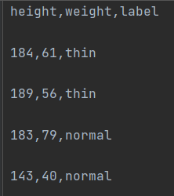

# python

#### Multicampus python 강의 (210104~)의 내용 정리

> interpreter 기반의 언어! (compile 기반이 아니다...)


## 연산자

`%` 나머지연산

`//` 몫 연산

`**` 제곱연산 (m**n : m의 n제곱)

## 비트연산자

`&` 논리곱

`|` 논리합


## list []

### 생성 방법

```python
a = []
a = list()

#range() 사용해서 만드는 방법
a = list(range(1, 10, 2))
```

### indexing

```python
a = [1, 2, 3, 4, 5]
a[3]
```

### slicing

```python
a = [1, 2, 3, 4, 5]
a[0:3]
a[0::-1] #거꾸로 슬라이싱
```

### list 수정

```python
a = [1, 2, 3]
b = [4, 5]
```

`a.appned(b)` => [1, 2, 3, [4, 5]]

`a.extend(b)` => [1, ,2, 3, 4, 5]

`del a[1]` = `a.pop(1)` => [1. 3]


## tuple ()

> 수정 X, 삭제 X

### 생성방법

```python
b = ()
b = tuple()
b = 1,2,3,4,5
```


## dictionary {}

> 순서 X, 키 중복 X, (key : data 쌍)

### 생성방법

```python
c = {"1" : "first", "2" : "second"}
c = dict()
c = dict([("a", "b"), ("c", "d")]) #tuple 활용하는 방법
c = dict(
	a = "first",
	b = "second")
```

### 키 추가

```python
c["3"] = "Third"
```


### 키-값 제거

```python
del c['3']
c.pop('3')
```


### 데이터 확인

```python
c.get("1") #key 만 넣어서 value를 확인할 수 있다
c["1"]
```

### 관련 함수

```python
c.keys() #key만 모아서 dict_keys 타입으로 반환
c.values() #value만 모아서 dict_values 타입으로 반환
c.items() #item 쌍을 모아서 dict_items 타입으로 반환
c.clear() #모든 내용 제거
c.get(key, value) #dic에 'key'가 없으면 dafault값인 'value'를 반환 / key가 있으면 그 뒤에 들어가는 작업(value에 1 더하기)을 수행 c.get(key, value) + 1
c.get(key) #dic 안에서 key값에 해당하는 value를 반환
```

- `list` 나 `tuple`과 같이 보이는 타입이지만 아니라서 list 나 `tuple`에 사용할 수 있는 함수 사용 불가능

- **for문과 같이 반복의 매체로는 사용 가능**

   	

## set{}

> 순서 X, 중복 X

### 관련 함수

```python
`& == intersection() # 교집합
| == union() #합집합
- == difference() #차집합
add()
remove()
discare()
```


## range()

```python
range(1, 10) #1~9까지 범위
range(2, 50, 2) #2~49까지 2씩 커지는 값들만
```


## str

문자열도 `indexing` 과 `slicing` 이 가능

`text[: : 2]` 과 같은 방식으로 칸을 건너서 `slicing` 가능


## date type

> import해서 사용해야 함

`from datetime import date` 이나 `from datetime import datetime` 으로 import

한번에 그냥 `import datetime` 으로 import 하는것도 괜찮을지도?


- date : 시간정보 없음
- datetime : 시간정보 있음

`timedelta()` 사용해서 날짜 연산 가능 (days, hours 등 가능, years months 불가능)


추가 기능이 필요하다면 

[python-dateutil]: https://pypi.org/project/python-dateutil/	"dateutil"

 패키지 설치해서 사용.

```python
 from dateutil.relativedelta import * #year 나 month 연산 가능
 from dateutil.parser import *  #특정 형태로 반환
```

### 문자열 -> 날짜 type 변환

(변수 = '2021,01,06-11:12:40' )일때 `strptime(변수, '%Y, %m, %d - %H:%M:%S')`로 type 변환 가능 .(형태과 완전히 동일해야 함)


## for loop

> list 선언시 for, if를 활용할 수 있다. dict 선언시에도 사용 가능 (comprehension)

```python
a= [1, 2, 3, 4, 5]
#사용 예시
tmp_list = [tmp ** 2 for tmp in a]
tmp_list2 = [tmp * 2 for tmp in a if tmp%2 == 0]
```


### enumerate

` for p in enumerate(a)` 와 같은 방법으로 사용 : 몇번째 반복인지 tuple 형태로 반환

```python
a= [1, 2, 3, 4, 5]
for index, value in enumerate(a): #인덱스, 원소 순서로 반환
    print(index, value)
0 1
1 2
2 3
3 4
4 5   
```

### for - else 

반복 가능한 부분이 모두 반복된 후  else 부분이 실행됨

```python
for x in range(5):
    print(x)
else:
    print('end')
```


## while loop

while - else 도 사용 가능


## 기타

### print 옵션

### sep 

문자열 사이에 구분자 추가

``` python
print("abc", "def", sep="\n")
```

- \n : 개행
- \t : 탭 
- \000 : 널 문자

### end

print 다 끝나고 난 뒤에 구분자 추가

```python
print("abc", "def", end='\n')
```


### print 방법

여러 변수 같이 출력

``` python
a = 10
b = "text"
print('{} {}' .format(a, b))
print('%d %s' %(a, b))
```


### dir() 내장함수

해당 인자의 객체와 메소드를 가지고 있는지 보여줌


### 그 외 내장함수

. capitalize()

. upper()

.split()

.replace()

. strip()

.len()

.endswith()

.count()

.find()

.index()


### 문자열에 특정 단어 포함, 미포함 확인

```python
('sample' in myStr)
('sample' not in myStr)
```

`boolean` 으로 결과 return


### random

`import ramdon`

```python
.random() # 0~1 사이 랜덤 실수
.randint(n, m) # n~m 사이 랜덤 정수
.choices(list, k = n) #list 값들 중 n개 랜덤 선택
```


## function

`from #### import @@@ as x`  == `from ####.@@@ import %%`

`import *`는 해당 모듈의 모든 함수를 다 사용하겠다 라는 뜻


### default parameter

```python
def demoFunction(x, y, z = True):
```

`=True` 라고 지정하는 부분이 `default parameter` => 함수 호출시 비어있는 인자의 자리에는 True가 들어간다.


### 특징 (자료형 특징)

function에 전달되는 매개변수가 `mutable, immutable` 인지가 중요!

- mutable : list, dict => function으로 전달될 때 동일한 객체의 주소만 전달한다. (function 내부에서 수정된 값이 global 반영된다)
- immutable : int, string, tuple => function으로 전달될 때 다른 객체가 생성된다.

### nested function (중첩 함수)

- function 내부에 들어가는 functino으로, 부모함수 바깥에서 호출할 수 없다

  ```python
  def outer(num1):
      def inner(num2):
          print(num2)
      inner(num1+100)
  outer(200)
  ```

- 가독성 좋다!

### recursive function (재귀함수)

- 함수 내부에서 함수를 다시 호출하는 방식


### lamda  function

- 가독성 향상, 메모리 절약 

``` python
(lambda x, y : x*y )(10,20)

#위와 동일한 funtion
def multiply(x, y):
	return x*y
multiply(10, 20)

#아래와 같이 사용도 가능 : 함수의 인자로 사용(function, lambda 모두 사용 가능)
def lambdaDemo(x, y, func):
    print(x*y*func(100,100))
lambdaDemo(10, 20, lambda x,y : x*y)
```


### hint

```python
def funcDemo(word : str, num : int):
```

함수의 매개변수 type을 미리 지정할 수 있음


### 형태

```python
def function1(): #매개변수 X, return X
	print('out')
def function2(): #매개변수 X, return O
    return 'out'
def funciton3(x): #매개변수 O, return O
    return x + "out"
def function4(*x): #매개변수 개수 제한 없이 tuple로 입력 받는다
    return 
def function5(**x): #매개변수 개수 제한 없이 dict로 입력 받는다
    return
```


### return 특징

return 값이 2개 이상인 경우에는 tuple 형태로 return 된다


## Class

> 'class는 설계도면, instance는 설계도를 가지고 만들어진 건물' 과 비슷한 느낌

### 형태

```python
class Demo:
    x = 0  #클래스 소유의 변수 : instance가 공통으로 사용함
    
    def __init__(self): # 객체 생성시 호출되는 메소드 : 초기화	
    	pass
    def function(self): # 사용자 정의 메소드이고 인스턴스의 소유가 됨
        pass
```

`self` : instance의 소유라는 것을 명시

- `__init__`을 정의하지 않아도, 자동으로 인자가 없는 메소드로 생성된다.


### naming rule 

- user define function
  - setXXXX
  - getXXXX
  - isXXXX

### class method

```python
class Demo:
    raiseRate = 1.1
    @classmethod #꼭 적어줘야 함.
    def updateRate(cls, num):
        cls.raiseRate = num
```

- method 안에서 method의 `class property`, `class method`에 접근할 때 사용 

### static method

```python
class Demo:
    raiseRate = 1.1
    @staticmethod #꼭 적어줘야 함.
    def updateRate(num):
        Demo.raiseRate = num
```

- method의 실행이 instance나 외부 상태에 영향을 끼치지 않을 때 사용 (class 밖에서 실행할 때)


## Object Oriented Programming

```python
def __init__(self)
```

- 초기화 함수 선언은  class당 한번만 가능하다.


### super()

`부모 class`의 메소드를 상속할 때 사용

```python
class Person(object):
    def __str__(self, name, age, address):
        self.name = name
        self.age = age
        self.address = address
class StudentVO(Person):
    def __str__(self, name, age, address, stu_id):
        super().__init__(name, age, address)
```

#### 장점

- 상속받는 class 이름이 달라져도 사용 가능!
- 이름을 적지 않고 참고하기 때문에 유지보수가 쉽다!


### 은닉화  (encapsulation ? Information hiding?)

```python
# 변수와 함수에 메소드에 모두 사용 가능
class MyDate(object):
    def setYear(self, year):
        if year < 0:
            self.__year = 2021 # __year 변수는 private 상태로 선언됨
        else:
            self.__year = year
    def getYear(self):
        return self.__year
	def __getInfo(self): #__getInfo 메소드는 외부에서 호출 불가
        return
```

- 변수, 메소드 이름 앞에 `__`를 붙여주면 인스턴스에서 직접 접근 `불가능`

- `setYear`와 같은 방법으로 간접 접근만 가능함

  

### 다형성 

- 상위 class 에 정의된 메소드를 하위 class에서 재정의 (method overriding)
- 부모 class 에 있는 메소드와 동일한 이름으로 하위 class에서 재정의


### 다중상속

- method overriding 된 메소드는 먼저 상속받은 클래스의 메소드가 실행됨.

  

### 추상화

- 추상 class 는 객체 행성 불가능
- 추상 method를 가지는 class는 : 추상 class
- 함수 구현을 강제하기 위해 사용됨 (부모 class 를 추상화 시켜서 자녀 class 강제 사용)

```python
from abc import *

class Base(metaclass=ABCMeta):
    @abstractmethod
    def study(self):
        pass
```


### 데코레이터

- 함수를 수정하지 않고 다른 기능을 구현할 때 사용
- 함수에 다른 함수를 인자로 전달하여 사용

```python
def decorator(func): # 데코레이터 함수 선언
    def wrapper():
        print(func.__name__, '시작') # 이 부분이 공통으로 들어가게, 하지만 여러번 작성하고 싶지 않다.
        func() 					  # 이 부분에 함수를 전달해서 decorator 를 사용하자!
        print(func.__name__, '끝') # 이 부분이 공통으로 들어가게, 하지만 여러번 작성하고 싶지 않다.
    return wrapper

def king():
    print('i am king')
def queen():
    print('i am queen')
    
# 사용방법 1
king_1 = decorator(king)
king_1()
queen_1 = decorator(queen)
queen_1()

# 사용방법 2
@decorator
def prince():
    print('i am prince')
prince()
```

```
king 시작
i am king
king 끝
queen 시작
i am queen
queen 끝
prince 시작
i am prince
prince 끝
```

- parameter 개수과 관계없이 적용 가능하게 만들기 -> 가변인자 `*args`사용하면 가능


- class 의 method에도 적용 가능. 외부에 만들어둔 함수를 class 내부에서 사용

```python
def tagH1(func):
    def wrapper(self, *args): #인스턴스가 호출할 수 있다는 의미로 self 넣어줘야 함
        return '<h1>{}</h1>' .format(func(self, *args))
    return wrapper

class Per(object):
    def __init__(self, name):
        self.name = name
    @tagH1
    def getName(self):
        return self.name
```


### iterator 이터레이터

iterable 보다 iterator 사용하는게 동작 속도가 더 빠르다 (적은 자원으로 큰 데이터 처리)

```python
userlist = [1, 2, 3, 4, 5]
a = iter(userlist)
print(next(a))
```

순차적으로 다음 데이터를 리턴할 수 있는 객체

- 내장함수 `next()` 사용해서 순환하는 다음 값을 반환함

#### iterable 객체와는 다르다!

list, tuple, dict, sting 은 iterator 객체가 아님!

- 관련 예시

  ```python
  class Counter:
      def __init__(self, stop):
          self.stop = stop
      def __iter__(self): #iterable로 만들어주기 위해서 필요한 내장함수
          return CounterIterator(self.stop)
  
  class CounterIterator:
      def __init__(self, stop):
          self.current = 0
          self.stop = stop
      def __next__(self):
          if self.current < self.stop :
              rtnValue = self.current
              self.current +=1
              return rtnValue
          else:
              pass
  
  cnt_iterator = iter(Counter(10))
  print(next(cnt_iterator))
  ```

  


### generator 제너레이터

```python
def textSequenceFunc():
    msg = 'hi python'
    for txt in msg:
        yield txt #yield를 통해 현재 값을 호출된 곳에 전달하면서 현재 실행 상태를 저장후 재실행하면 저장된 곳부터 실행

char_iter = iter(textSequenceFunc())
next(char_iter)
```


### composition == aggregation

상속을 받지 않고 class의 일부 기능만 가져다 쓰는 기능

```python
class Calc02(object):
    def __init__(self, x, y):
        self.x = x
        self.y = y
        
    def mutiply(self):
        return self.x * self.y
    
class userCalc:
    def __init__(self,x ,y):
        self.x = x
        self.y = y
        self.cal02 = Calc02(x,y) #객체를 명시적으로 생성

    def multiply(self):
        return self.cal02.mutiply() #생성한 객체로 필요한 method 호출해서 사용.
```


### exception

> 프로그램이 동작하다가 에러로 중단되지 않게 해주는 기능

`try` :  에러가 발생 할 가능성이 있는 코드 (정상 코드)

`except` : 발생된 에러를 잡기위한 객체 정의 (예외가 발생 할때만 수행)

- 프로그램의 흐름을 정상적으로 컨트롤
- 예외 발생의 디버깅
- 로그파일 만들어서 예외정보를 저장

`else` : 에러가 발생되지 않을 때 실행되는 블럭

`finally` : 무조건 수행

```python
def userKeyIn():
    try :
        age = int(input('본인의 나이를 입력하세요'))
        print(age)
    except ValueError as e:
        print(e.args[0])
    except IndexError as e:
        userKeyIn()
    else:
        print("정상 동작시에만 실행되는 부분", age)
    finally:
        print("항상 실행되는 부분")
```

`    except Exception as e `:이거 하나로 다중 except를 대체 가능 


예외 강제 발생

```python
class Account:
    def __init__(self, account, balance, interest_rate):
        self.account = account
        self.balance = balance
        self.interest_rate = interest_rate

    def withDraw(self, amount):
        try:
            if self.balance < amount:
                raise Exception ('에러 발생')  # 에러 강제 발생
        except Exception as e:
            print('잔액이 부족합니다')
        else:
            self.balance -= amount

account = Account('100', 10000, 0.073)
account.withDraw(200000)
print('프로그램 종료')
```

```python
class InsufficientError(Exception): #에러를 클래스로 정의해서 사용하는 것도 가능
    def __init__(self, msg):
        self.msg = msg
        
raise InsufficientError('사용자 정의 에러 발생!') #에러 강제 발생
```


### 클래스 없이 객체 생성

> 변수만 있는 class 가 필요할때 사용

`collections.namedtuple('클래스 이름',  (변수) or [변수])`

```python
import collections

Persona = collections.namedtuple('Person', ['name', 'id']) # list 형식
Persona = collections.namedtuple('Person', 'name id') # tuple 형식
Persona = collections.namedtuple('Person', 'name, id') # string 형식
per = Persona('lee', 100)
print(per, type(per))
```

결과 : `Person(name='lee', id=100) <class '__main__.Person'>`


속성 접근 방법 1

```python
per[0] # name
per[1] # id
```

속성 접근 방법 2

```python
per.name
per.id
```

속성 접근 방법 3

```python
name, id = per
print(name, id)
```


## 파일 입출력

`open()`

`with open()` : file.close()를 해줄 필요가 없다. 자동으로 종료 됨

```python
file = open('ai/project/test.txt', 'r')
with open('ai/project/test.txt', 'r') as file
```

### mode

- `w` : 쓰기 

- `r` : 읽기

- `a` : append (뒤에다 내용 추가)

  

### 관련 함수

- `.read()` : 내용 읽어서 반환
- `.write('내용')` : 내용을 파일에 씀
- `.readline()` : 한줄씩 읽어서 반환, 자동으로 뒤에 `'\n'`이 추가됨
- `.readlines()` : 한줄씩 전체를 다 읽어서 한줄씩 리스트 요소에 넣어 리스트로 반환 

```python
a = file.read()
file.write('{}' .format(data))
```

### 기타

text로 이루어진 파일은 loop를 돌릴 수 있음

```python
file = open('ai/project/test.txt', 'r')
for line in file:
	print(line)
```


### bianry 형태의 입출력

#### 객체 직렬화 (serializable)

```python
import pickle

scores = {'kor' : 90, 'eng' : 95, 'math' : 70, 'sci' : 82}
with open(file='dict_pickle.txt', mode='wb') as file:
    pickle.dump(scores , file)  #file에 scores 객체를 직접 저장
```

- 객체를 직접 저장하는 방식       


###  pandas

#### csv



이런 데이터를 csv로 읽어오면, 아래와 같이 접근 가능 (series 타입 반환)

```python
bmi = pd.read_csv('./word/service_bmi.csv', header=None, encoding='utf-8')
bmi.info()
bmi.head() # 앞쪽 만 보여줌
bmi.tail() # 뒤쪽 만 보여줌
bmi.height # height 열만 보여줌
bmi['weight'] # weight 열만 보여줌
```


#### excel

- excel 파일 접근을 위해서는 `xlrd`, `openpyxl` 패키지 설치 필요

```python
kospiDataest = pd.ExcelFile('./word/sam_kospi.xlsx')   # 엑셀 파일 불러오기
kospi = kospiDataest.parse('sam_kospi') # 특정 시트에 접근
```


#### json

- 네트워크 상에서 표준으로 사용되는 파일 형식 : key:value 로 되어있음
- encoding : dict, list       -> json 문자열로 변환 : dumps() / 반환되는 type은 string
- decoding : json 문자열 -> dict, list
- `import json` 필요

```python
#encoding
user = {'id' : 1234, 'name' : '섭섭해'}
jsonStr = json.dumps(user)

#decoding
user2 = json.loads(jsonStr)
```


## 정규표현식

`import re` 임포트해서 사용. (regular expression)

### 메타문자

`.` : 무엇이든 한 글자 의미

`^` : 시작문자 지정

`*` : 0 or more

`+` : 1 or more

`?` : 0 or 1

```
[abc]     : a, b, c 중 한개의 문자와 매치
[^0-5]    : 0-5로 시작하는 것 제외하고 매치
^[0-5]    : 0-5로 시작하는 것과 매치
```

### 문자 클래스

`\d` : 숫자의 자릿수

`\D` : 숫자가 아닌 문자 매칭의 자릿수

`\w` : 문자 + 숫자

`\W` : 문자+숫자 아닌 문자와 매치

`\s` : 공백																																																																																																									

### 기타 함수

`zip()`

- 요소의 개수가 많은  list를 묶어서 tuple로 반환

```python
num = [1, 2, 3, 4]
name = ['lee', 'kin', 'park', 'man']
dic = {}
for keym value in zip(num, name):
    dic[key] = value
```

